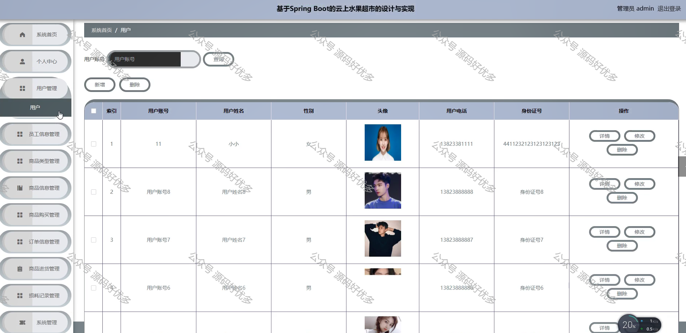
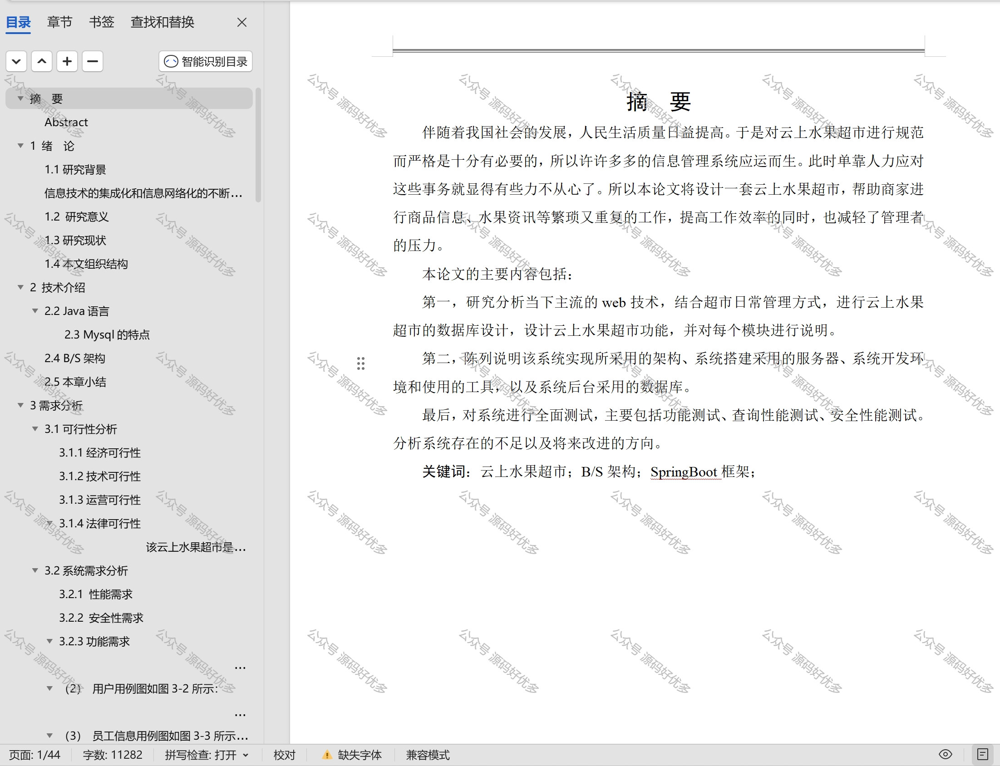

 
## 查看主页获取源码

> **作者介绍**： **✌**全网粉丝10W+本平台特邀作者、博客专家、CSDN新星计划导师、java领域优质创作者,博客之星、掘金/华为云/阿里云/InfoQ等平台优质作者、专注于项目实战 **✌**

  

### 一、作品包含

源码+数据库+设计文档万字+PPT+全套环境和工具资源+部署教程

### 二、项目技术

前端技术：Html、Css、Js、Vue、Element-ui

数据库：MySQL

后端技术：Java、Spring Boot、MyBatis

  

### 三、运行环境

开发工具：IDEA/eclipse

数据库：MySQL5.7

数据库管理工具：Navicat10以上版本

环境配置软件： JDK1.8+Maven3.6.3

前端Nodejs：14

  

### 四、项目介绍
项目编号：springbootA101

云上水果超市系统通过集成高效的在线销售、库存管理和数据分析功能，为水果零售商提供便捷的数字化运营解决方案，以提升销售业绩和顾客体验
该系统包括管理员、员工信息、用户三个角色，每个角色都有其对应的功能。
管理员的角色包括商品类型管理、商品信息管理、商品购买管理、订单信息管理、商品进货管理、损耗记录管理、系统首页、个人中心、用户管理、员工信息管理、系统管理。
员工信息的角色包括系统首页、个人中心、商品信息管理、商品购买管理、订单信息管理、商品进货管理、损耗记录管理。
用户的角色包括系统首页、个人中心、商品购买管理、订单信息管理。

### 五、运行截图

  
